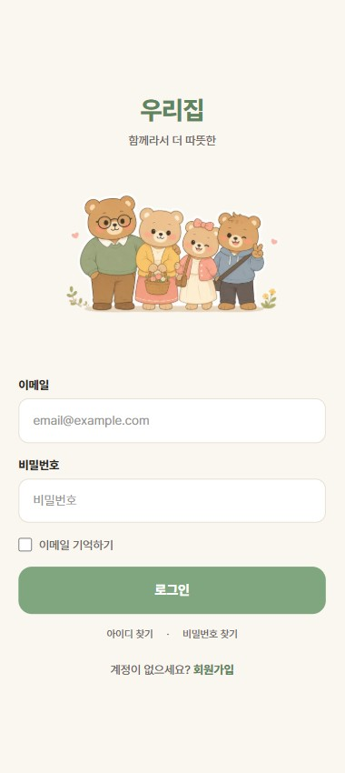
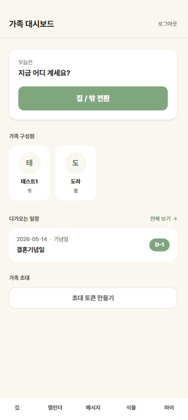
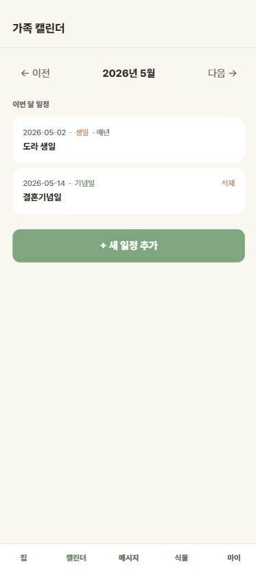
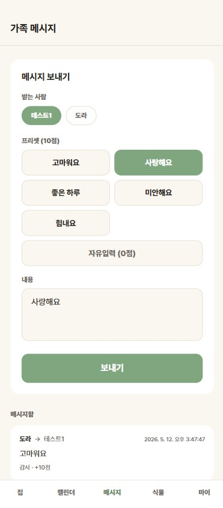
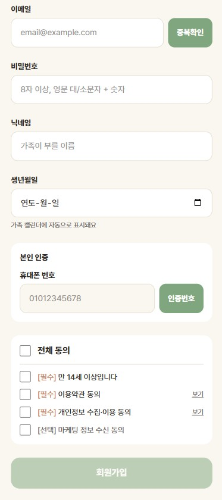
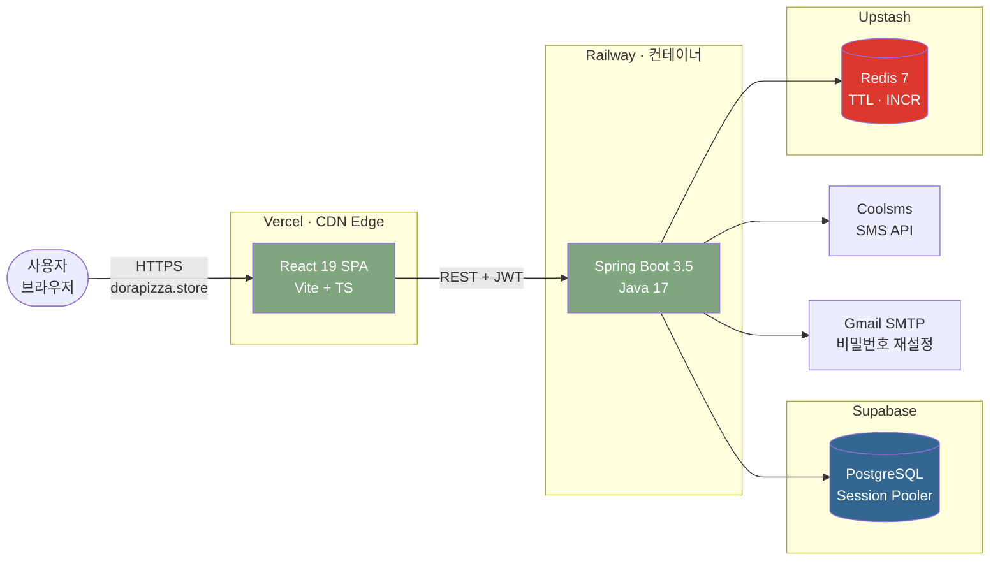
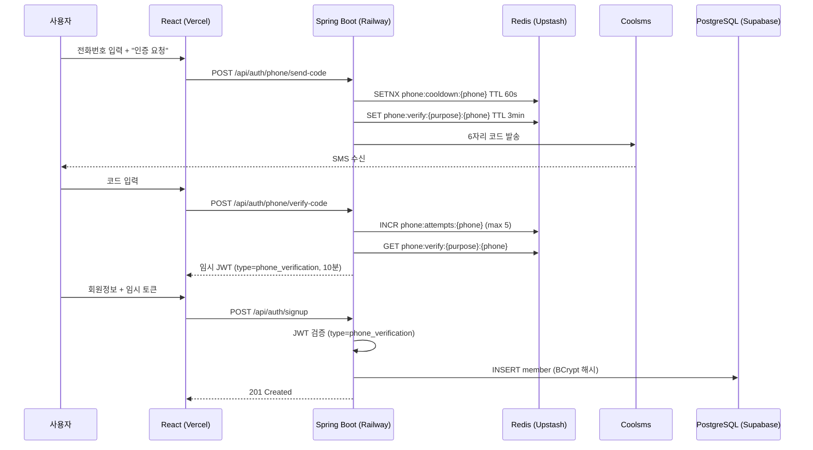
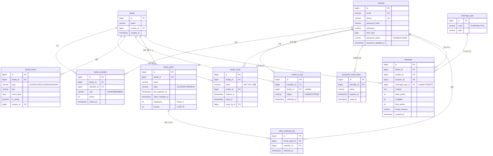
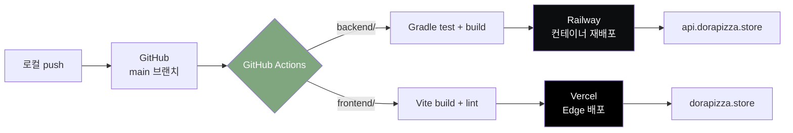

# 우리집

> 가족 커뮤니티 웹앱 — 떨어져 사는 가족과 캥거루족 모두를 위한 "존재와 마음 확인" 서비스

[]()
[]()
[]()
[]()
[]()
[]()
[]()


단독 풀스택 프로젝트 (Spring Boot + React 19) · 실서비스 운영 중

---

## 미리보기

| 로그인 | 대시보드 | 가족 캘린더 |
|:---:|:---:|:---:|
|  |  |  |

| 프리셋 메시지 | 회원가입 (SMS 인증) |
|:---:|:---:|
|  |  |

---

## 컨셉

가족이 서로 공유할 수 있는 어플이 없다는 문제에서 출발.
GPS 추적이 아닌 **가족이 서로의 존재와 마음을 확인하는** 공간을 지향합니다.

### 타깃
- 떨어져 사는 성인 자녀와 부모 (1인가구 증가 추세)
- 같이 살지만 생활 시간대 어긋나는 캥거루족

### 차별점
1. **가족 전용 자동 공유 캘린더** — 생일·기념일·제사 자동 반복 공유
2. **표현 비용 낮추는 프리셋 + 곱셈식 배수** — 낯간지러움 장벽 해소, 이벤트 곱셈 (어버이날 ×2 + 엄마생신 ×2 = ×4)
3. **가족 공용 식물 = retention 후크** — 24h→WILTED, 72h→DEAD 상태 기계, 공동 책임제

---

## 기술 스택

### Backend
- Java 17 · Spring Boot 3.5 · Gradle
- Spring Data JPA · Spring Security · jjwt 0.12.3
- PostgreSQL (Supabase Session Pooler · IPv4)
- Redis 7 (phone verification, TTL 자동 만료)
- JUnit 5 · Mockito · AssertJ
- Coolsms (SMS 본인인증) · Gmail SMTP (비밀번호 재설정 메일)

### Frontend
- React 19 · TypeScript · Vite
- Tailwind CSS v4 · React Router v7 · Axios

### Infra
- **Railway** (backend) — Spring Boot 컨테이너 자동 배포
- **Vercel** (frontend) — Vite SPA 빌드 + Edge CDN
- **Supabase** — PostgreSQL Session Pooler (IPv4)
- **Upstash Redis** — TLS Serverless
- **GitHub Actions** — push 시 빌드/테스트/배포 자동화

---

## 주요 기능 (MVP 8개 · 백엔드 100%)

| # | 기능 | 핵심 설계 |
|---|------|----------|
| 1 | 회원가입 / 로그인 | BCrypt · JWT (Access 30분 + Refresh 7일) · `JwtAuthenticationFilter` |
| 2 | 가족 그룹 + 초대 | JWT 초대 토큰 (24h, 1회용) · `markAsUsed()` 도메인 메서드 |
| 3 | 가족 대시보드 | 수동 집/밖 토글 · denormalized current state · N+1 회피 (`findAllById`) |
| 4 | 가족 캘린더 | 단일 `family_event` 테이블 + 매년반복 · 생일은 query 시점 계산 (가상 이벤트) |
| 5 | 체크인 로그 | 이벤트 소싱 패턴 · 시계열 복합 인덱스 `(member_id, checked_at DESC)` |
| 6 | 귀가 시간 통계/예측 | 분포 기반 통계 (Spring Stream · Java만) · 외출/귀가 평균 + 오늘 vs 평균 비교 |
| 7 | 프리셋 메시지 + 포인트 | 하루 3회 한도 · 이벤트 곱셈 `2^n` · 공휴일 + 가족 매년반복 합산 |
| 8 | 가족 공용 식물 | `@Version` 낙관적 락 · `@Scheduled` 1시간 주기 배치 · 24h grace period |

### 실서비스 인증 강화
- 이메일/전화 중복 확인
- SMS 본인 인증 (Coolsms · Redis TTL 3분 · cooldown 60초 · atomic INCR 시도 횟수)
- ID 찾기 (마스킹된 이메일 응답)
- 비밀번호 재설정 (메일 토큰 1시간 만료, 1회용)
- 이메일 enumeration 방지 (계정 존재 여부 응답 통일)

---

## 아키텍처



### 요청 흐름 — 회원가입 (SMS 본인 인증)



---

## 시스템 설계 — 핵심 결정

### 4종 JWT 체계 (`type` 클레임으로 분리)
| 종류 | 만료 | 용도 |
|------|------|------|
| Access | 30분 | API 인증 (Authorization 헤더) |
| Refresh | 7일 | Access 재발급 |
| Invite | 24h, 1회용 | 가족 초대 링크 |
| Phone Verification | 10분 | SMS 인증 후 가입/ID찾기 임시 토큰 |
| Password Reset | 1시간, 1회용 | 비번 재설정 메일 토큰 |

### JPA Dirty Checking 적극 활용
- 도메인 메서드 (`togglePresence()`, `water()`, `markAsUsed()`)에서 상태 변경
- `save()` 명시 호출 최소화 → 영속성 컨텍스트가 자동 UPDATE
- 학습 포인트: Transient vs Managed 구분, save가 필요한 순간(신규 INSERT)만 호출

### 이벤트 소싱 입문 (CQRS 라이트)
- `check_in_log` = 영구 이벤트 스트림 (모든 토글 누적)
- `member.presence_status` = 캐시된 현재 상태 (denormalized)
- 미래 분석 정의 변경에 raw 데이터로 자유롭게 대응 가능

### N+1 회피
- 컬렉션 nickname/typeName 매핑 시 `findAllById(IDs)` IN 절 1쿼리
- Map<Long, String> lookup으로 O(1) 매핑

### Redis 활용 (휘발성 vs 영구 분리)
- `phone:verify:{purpose}:{phone}` — TTL 3분 자동 만료
- `phone:cooldown:{phone}` — SETNX cooldown
- 시도 횟수 — atomic INCR (race condition 방지)
- 결과: `phone_verification` 테이블 DROP, `invalidateActiveCodes` UPDATE 쿼리 소멸

### MDC 기반 요청 단위 로깅
- `MdcLoggingFilter` (`OncePerRequestFilter`) — UUID 8자리 requestId + userId
- finally MDC.clear (스레드 풀 재사용 환경에서 데이터 누수 방지)

---

## API 엔드포인트 (21개)

### 인증 (`/api/auth`)
- `POST /signup`
- `POST /login`
- `POST /email/check`
- `POST /phone/send-code`
- `POST /phone/verify-code`
- `POST /find-id`
- `POST /password/reset-request`
- `POST /password/reset-confirm`

### 본인 (`/api/me`)
- `POST /presence/toggle`
- `GET /check-in-logs?days=N`
- `GET /predictions/leave-time?days=N`
- `GET /predictions/return-time?days=N`
- `GET /predictions/today-comparison?days=N`

### 가족 (`/api/families`)
- `POST /` (생성)
- `POST /{familyId}/invites` (초대 생성)
- `POST /invites/accept` (초대 수락)
- `GET /{familyId}/dashboard`
- `GET /{familyId}/check-in-logs?days=N`
- `POST /{familyId}/events` · `GET /{familyId}/calendar?year=Y&month=M` · `DELETE /{familyId}/events/{id}`
- `GET /{familyId}/messages`

### 메시지 / 식물
- `POST /api/messages`
- `POST /api/families/me/plant` (심기)
- `GET /api/families/me/plant` (조회)
- `POST /api/families/me/plant/water` (물주기)
- `POST /api/families/me/plant/revive` (부활)

---

## 테스트

### 단위 테스트 50+ 케이스 (JUnit 5 + Mockito + AssertJ)
| 도메인 | 케이스 수 |
|--------|-----------|
| AuthService | 5 |
| FamilyService | 5 |
| MemberService | 3 |
| CalendarService | 7 |
| CheckInLogService | 4 |
| PlantService | 12 |
| MessageService | 9 |
| PredictionService | 7 |

### Postman 회귀 테스트
- 회원가입 → SMS 인증 → 로그인 → 가족 생성 → 초대 → 수락 → 토글 → 캘린더 → 메시지 → 식물 한 사이클 검증

---

## ERD



> 생일은 별도 row 없이 query 시점에 `member.birth_date`에서 가상 이벤트로 계산. 가입/탈퇴 동기화 코드 0줄.

---

## 데이터 모델 (요약)

### 영구 데이터 (PostgreSQL)
- `member` — 사용자 (phone UNIQUE, presence_status, presence_updated_at)
- `family` / `family_member` (UNIQUE family_id+member_id, role, points)
- `family_invite` (token, expires_at, used_at, used_by_id)
- `family_event` (type, event_date, is_yearly)
- `check_in_log` (시계열 인덱스 2종)
- `family_plant` (UNIQUE family_id, @Version) / `plant_watering_log`
- `message` / `message_type` / `special_holiday`
- `password_reset_token`

### 휘발성 데이터 (Redis)
- 전화번호 인증 코드 (TTL 3분)
- 재발송 cooldown (TTL 60초)
- 시도 횟수 (atomic INCR)

---

## 디렉토리 구조

```
house/
├── backend/                  # Spring Boot 3.5 / Java 17
│   └── src/main/java/com/example/house/
│       ├── auth/             # 회원가입, 로그인, SMS, 비밀번호 재설정
│       ├── domain/           # JPA 엔티티 + 도메인 메서드
│       ├── family/           # 가족 그룹/초대/대시보드/캘린더
│       ├── plant/            # 가족 공용 식물 + 스케줄러
│       ├── message/          # 프리셋 메시지 + 포인트
│       ├── checkin/          # 체크인 로그
│       ├── prediction/       # 귀가 시간 통계
│       ├── security/         # JwtUtil, JwtAuthenticationFilter, MdcLoggingFilter
│       ├── exception/        # GlobalExceptionHandler
│       └── config/           # SecurityConfig, RedisConfig, CorsConfig
├── frontend/                 # Vite + React 19 + TypeScript
│   └── src/
│       ├── api/              # axios client + JWT 자동 헤더
│       ├── pages/            # Login/Signup/Dashboard/Calendar/Plant/...
│       └── components/       # PhoneVerifier 등 공통
├── docs/
│   ├── mockup/               # HTML+CSS 9화면 시안 (세이지 그린 톤)
│   └── planning-artifacts/   # PRD, existing-notes
└── README.md
```

---

## 디자인 시스템

세이지 그린 톤 (공용 식물 retention 후크 + 시니어 친화)

| 토큰 | 색상 | 용도 |
|------|------|------|
| primary | `#7FA67E` | 세이지 그린 (메인) |
| accent | `#C97D60` | 테라코타 (강조) |
| bg | `#FAF6F0` | 아이보리 (배경) |
| text | `#2D2A26` | 다크브라운 (본문) |

---

## 로드맵

### 완료
- [x] 백엔드 MVP 8개 기능 (회원가입~식물)
- [x] 단위 테스트 50+ 케이스
- [x] 실서비스 인증 강화 (SMS · 메일 · 비번 재설정)
- [x] Redis 도입 (phone verification 이전)
- [x] auth flow 한 사이클 브라우저 검증
- [x] `@SpringBootTest` 통합 테스트
- [x] 프론트 페이지 전체 완성 (대시보드 · 캘린더 · 식물 · 메시지 · 마이페이지)
- [x] **Railway (백) + Vercel (프론트) 배포 완료** ([dorapizza.store](https://dorapizza.store))
- [x] **GitHub Actions CI/CD** — push 시 자동 빌드/테스트/배포
- [x] HTTPS / CORS Production 설정

### Phase 2 (예정)
- [ ] OpenAI API 메시지 추천 (프롬프트 엔지니어링)
- [ ] RAG 패턴 — 가족 데이터 + LLM 인사이트
- [ ] MCP 서버 — Claude Desktop 등에서 우리집 데이터 조회
- [ ] React Native + GPS 자동 체크인 (수동은 폴백 유지)
- [ ] 카카오 소셜 로그인
- [ ] 웹 푸시 알림 + PWA

---

## CI/CD 파이프라인



---

## 트러블슈팅 / 학습 회고

- **`-parameters` 플래그 없는 환경 대응** — `@PathVariable("name")` / `@RequestParam(name="...")` 명시 패턴
- **JPA dirty checking 학습 곡선** — save가 필요한 순간(Transient vs Managed) 직접 부딪히며 영속성 컨텍스트 이해
- **JWT 4종 토큰 체계** — type 클레임으로 분리, NumberFormatException/MalformedJwtException 디버깅 통해 토큰 역할 학습
- **Spring `/error` permitAll** — validation 실패 시 forward 막혀서 403 났던 이슈
- **이메일 enumeration 방지** — 계정 존재 여부 응답 통일 (보안 패턴)
- **YAML 들여쓰기 사고** — spring 블록이 jwt 안에 들어가서 mail 설정 무시됨
- **Redis 도입으로 코드 단순화** — `invalidateActiveCodes` UPDATE 쿼리 → SET 자동 덮어쓰기로 소멸

---

## 라이선스

Private — 개인 프로젝트 (2026)
